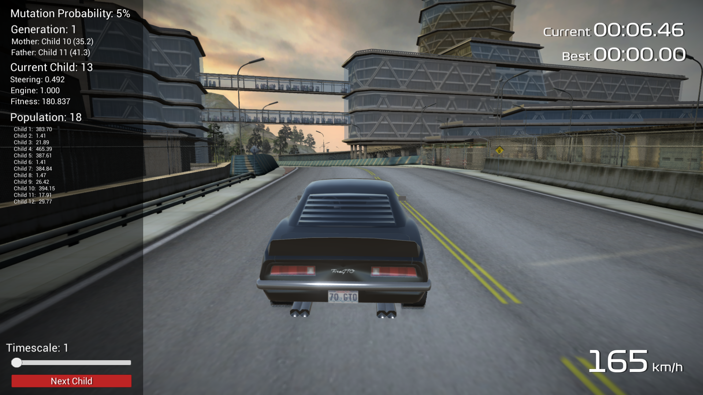

AIRace is a 3D racing game targeted at computer gamers and racing game enthusiasts, the game aims to enable users to drive around the track, either on their own or race against 
enemy cars. Enemy cars are driven by three separate algorithms, backpropagation, NEAT (NeuroEvolution of Augmented Topologies) a genetic algorithm and a pathfinding AI. AIRace 
was created using the Unity Game Engine, it implements two main features, Racing and Learning mode.

Racing mode focuses on the user interaction with the car and track, enabling a smooth and realistic gaming experience. AIRace uses custom car physics, including acceleration 
curves, steering, drag and camera movements which provides an authentic and unique driving experience. The user is able to select between a set of different cars, each of these 
cars will have different speed, handling and drivetrain characteristics. Within Racing mode, the game contains two separate features, timetrial and competition. In a timetrial, 
a user can race around a track on their own trying to beat their best time or practice for a future competition. In a competition, they will face against enemy cars which use the 
aforementioned algorithms to drive around the track. 

Learning mode allows users to visualise how the computer learns to go around a track. They can choose between genetic or 
backpropagation algorithms and experiment with various attributes pertaining to them such as fitness functions, mutation probabilities, learning rates, sensors lengths and 
population sizes. Experimenting with these attributes will show which one performs best under particular scenarios, allowing the user to compare both algorithms and their 
attributes.

# Project
AIRace has been created as part of the CA400 Final Year Project in DCU. This repo has been established in order to document the development process and display all source code. 

Please visit *docs/blog* and *docs/documentation* for the entire development process and *docs/video-walk-through* for a video demonstration.

# Installation Guide
1. Open the build folder located in this repository.
2. Here you will find a folder called “AIRace”.
3. Download the entire folder to your Windows Computer.
4. Open the folder and run the executable called “AIRace.exe”.

You will see a configuration window as shown in the screenshot above. Here you can select your display size and change whether you want to run the game in fullscreen mode or 
windowed. It is recommended to play AIRace on a computer with good graphics capability to be able to enjoy the game at its full potential. Graphics quality is recommended to be 
set to “Ultra”, but if the game seems to lag or stutter then quit the game and lower the graphics quality until the game is running smoother. When you are ready to start the game 
press “Play!”. If you wish to return to desktop simply click “Quit”.

# Screenshots

  

