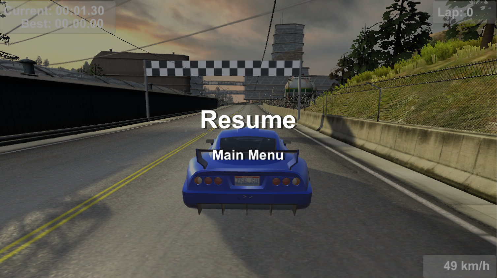

## Blog 1, Introduction & Ideas:

Welcome to my blog, here I will be documenting the development process for my 4th year project, my ideas, problems, solutions and how I went about developing my project. I want
to document my process in a way that if you follow along you will be able to understand everything clearly and learn what/how I did it. I have a heavy interest in games and
music, so basing my project around either of these fields will be of great benefit to me as I will be more invested in the project. Before starting here are some of the 
initial ideas I have came up with:

##### Audio to Sheet Music Transcriber
An Android Application that can convert mp3 piano recordings into sheet music/MIDI file
 
##### Multiplayer racing game in Unity
Racing game which contains multiple tracks and have the options to either play in a time trial or else against another player online.

##### AI racing game in Unity
Racing game where a user either plays in a time trial or where the user races against a (pathfinding or true AI??) 
or
Getaway game where a user tries to get away from an enemy AI car in a given map/track

##### 3D Navigation system made in Unity
A 3D modelled city where the user selects a start point and an end point and a car/bike/person gets from one point to the other using some sort of navigation system. 
(Pathfinding/true AI implementing NN)

## Blog 2, Meetings and Proposal:

I have spent the last 2 weeks reasearching which project is best suited for me, I have met up with multiple supervisors and have gained invaluble insight into how i should
continue with my project. After some careful consideration, research and advice from my project supervisor (Martin Crane) I have decided what I want to base my project on.

I want to develop a game using the Unity Game Engine. It will be a racing game which implements machine learning to automate the safety car and the enemy cars to race 
against you around a track. The game will have the “game” aspect where the user can race around a track and also a “learning” aspect where the user can see the car learning 
its way around a track and training itself for other tracks, I hope to try a few different algorithms and compare them between each other to see one performs best around a 
track. I plan to create car physics and implement my own version of machine learning to control the cars.

I have always enjoyed playing 
games and ever since I started Computer Applications I realised I would like to base my career in game development. Watching F1 you will notice that there is a safety car which 
goes around the track at the start of the race to warm up race cars, it also paces race cars during crashes while the track is being cleared. I want to create a 3D modelled game 
which automates this process using Machine Learning. The game provides a “racing” function where the user can play a racing game and a “learning” function where the user can 
see the learning process of the safety car which will be training on a given track, the goal is to train an AI to be able to perform on any track given after it has been 
trained, this extends into car automation in the real world. The user demographic will be computer gaming enthusiasts who enjoy racing games, currently on Steam (PC Gaming 
Platform) the top 10 racing games sold between 15-20 million copies. The reason why I think this project will be useful as it will teach me how to develop a game and 
implement machine learning within unity. With the recent gain in popularity of automated cars it would be beneficial to base my project around the automation of cars. 
Tesla, Google and Nvidia have invested millions into the development of automating cars making my project very valuable.

Next I will continue with my research and in-depth look into Unity, I have never before used worked with Unity, C# or 3D Modelling and therefore will need to focus my time on 
learning these skills. Another thing that I need to focus on is machine learning and which algorithm is most efficient for my solution, as my project relies heavily on 
implemening it corretly. To begin, I will look at some youtube tutorials as well as the official documentation found [**here**](https://docs.unity3d.com/Manual/index.html).

## Blog 3, Project Approval Panel Meeting:

This week I had my project approval meeting. Our 4th year project head told us to prepare answers to some questions, such as: description of the project, major features,
challenges and business impact. My presentation went great and the panel members gave me some useful tips to go ahead with the project. Tomas Ward outlined in his overview
of my presentation:

*"Open AI Gym is worth looking at. Make use of tutorials and resources online for physics simulation. Get to AI part quickly as there are interesting challenges there in 
particular. Reinforcement Learning is one way to go."*

My project idea has been approved and I will start working on a functional spec and continue my research, now with the tips which I recieved.

## Blog 4, Functional Specification & Planning:


The last 2 weeks have been primarily focused on finishing the funcitonal specification for AI Race. As the spec carries 10% of the entire CA400 module mark it was important to 
write it to a high standard, also as the spec is a "plan" for my project it was important to make it accurate and benefitial towards AI Race. The functional spec contains 
an overview of the main features of AI Race and how the system intends to work/integrate with other features. The functional spec also contains a number of diagrams which 
outline the processes of AI Race. A more in-depth view of the functional spec can be found [**here**](https://gitlab.computing.dcu.ie/khaletk2/2019-ca400-khaletk2/blob/master/docs/functional-spec/Functional-Specification.pdf)

Now that my functional spec is finished I will start the implementation of AI Race.


## Blog 5, Car Physics, Modelling & Mappings:

Before I start any machine learning implementation I believe it is important to get all the physics and car controls first. After some research on unity's own documentation
I found that unity doesnt provide car physics and controls that can be easily implemented, therefore I will need to implement my own version. To begin, I need a 3D modelled
car, I found some assets on the Unity Official Asset store. I dont have any previous experience 3D modelling so I decided to get one there and focus my time on the physics 
and controls of the car. When you get a car model on the store all you get is a 3D model, after which you have to add your own colliders which are physical objects that "collide"
with other objects in your enviroment, 3D model can be seen on the right and the colliders can be seen on the left (outlined as green lines).


After I added all the colliders I put in a simple ramp which would test the car rolling down the ramp, this can be seen in the gif below. The issue now is that the wheel
colliders need to be mapped to the acutal wheel models. Below you can see the car rolling down, but the wheels arent moving, yet when you look at the wireframe on the left
you can see the wheel colliders moving. This needs to added in a C# script, unity scripts is how the physics talk to the 3D models, here I will be adding my own car physics 
and controls. Here I will also be adding the steering controls for the car.


After mapping the wheel colliders to the wheel meshes I found that the front right and rear right wheels are both rotated 180 degreees on the wrong axis as shown in the gif
below. This is because when you add a wheel collider it only faces one direction, and in order to rotate it you need to write a script to rotate the wheels 180 degrees as it
moving.


```
if (i == 0 || i == 2){
    rot = rot * Quaternion.Euler(new Vector3(0, 0, 180));
}
else{
    rot = rot * Quaternion.Euler(new Vector3(0, 0, 0));
}
```

As the wheel meshes are stored in a list then i[1] and i[3] are the front-right and rear-right wheels, I rotated the wheel by 180 degrees in the Y-axis and now all 4 wheels
face the correct direction. Using the same principle I made the wheel meshes (rims) rotate in the same fashion as the car crives on the terrain. I also implemented a "centre of
gravity" to prevent the car from flipping over while driving trough intense corners, I've had some trouble with the 3D model axis at first, to fix this I created an empty
object and made it face the axis I need and moved all the objects of the car into the new temporary object in order to correct the axis of the car. Next I will need to implement
a way for the user (and system in the future) to interact with the car, basically controls. I will need to manipulate the wheel colliders to follow the input controls which
I give them.udo pip install beautif

## Blog 6, Car Controls, Drive Wheel, Steering & Acceleration:

This week I worked on the input that controls the steering and acceleration. In order to get the input from keyboard you use ```Input.GetButton()``` which finds a button
you are pressing on the keyboard and ```Input.GetAxis()``` which returns a value for either left-right or up-down. Using ```Input.GetAxis()``` we can find the desired steer
angle. This fucntion returns a float, by multiplying this value by 45f we get a max steer angle of 45 degrees, and a smooth transition in between 0 and 45 degrees on both 
wheels. Now both front wheel colliders (and subsequently wheel meshes) are turned to an according steer angle desired by the user. Changing the max steer will change the 
force at which the car turns, this value can later be ajusted and even tweaked depending on the car selected, allowing for different characteristics between each car. 
Later in the project I would like to reduce the maxSteer angle at higher speeds, which will reduce oversteering.

When it comes to acceleration and general torque (forward & reverse) the implementation has become more troublesome. As the wheelcolliders act as turnable objects there is
no way to control their speed, only torque. My first acceleration implementation consisted of a torque that I applied to the wheels, the problem here is that the car will 
infinately speed up (and stay at that speed). Then I applied drag which slows the velocity of the whole car slowly, but this didnt stop the car from speeding up past realism.
I have researched online that a typical acceleraion curve looks like an "S", where at first there is a high acceleration, then it stays constant, then it starts slowing down
until it reaches a max speed. Based off that I decided to implement my own acceleration curve.


```
if (Speed() < dropSpeed) {
    scaledTorque = Mathf.Lerp(scaledTorque, scaledTorque / 3f, Speed() / dropSpeed);
} else {
    scaledTorque = Mathf.Lerp(scaledTorque / 3f, 0, (Speed() - dropSpeed) / (maxSpeed - dropSpeed));
}
```

As shown in the graph above you can see the amount of torque (Y-Axis) applied to the wheels and the speed at which the car is going (X-Axis). Dropspeed is the speed at which
the acceleration begins to level off. Maxspeed is the maximum speed a car can reach. If the speed is less than the dropspeed the interpolation value t grows between 0 and 1
depending on the speed. If the speed is greater than the dropspeed the interpolation value drops between 1 and 0 depending on the speed. This algorithm creates an acceleration
curve shown in the picture above and applies the scaledTorque value to the wheels by linearly interpolating (A and B by T), and (A1 and B1 by T1). All these values are variables
this allows me to have one car controller script and input different values for maxSpeed, dropSpeed and maxTorque. Allowing for different car characteristics, this can also
be seen in the drive wheel enum which I implemented, this checks if the car is either rear/front/4 wheel drive and will apply torque to the according wheels depending on the
car. Overall making better programming practices, and removes duplication of code.

Next I will work on some camera view and simple UI elements for the time being, this will be expanded upon after my implementation of AI.

## Blog 7, Car Camera & UI:

```
public float Speed() {
    return wheelColliders[3].radius * Mathf.PI * wheelColliders[3].rpm * 60f / 1000f;
}
```
```
public float Speed() {
    //3.6 to get km/h, 2.237f to get miles
    return car_rigidbody.velocity.magnitude * 3.6f;
}
```

When getting the car speed, initially I used the first formula to calculate the radius of the car and its RPM to get the speed in km/hr, but that turned out to be useless 
becuase if the wheels begin to spin the speed will increase, yet the car could be stationary. Instead I found that you can just get the valocity of the car, multiply it by
3.6 and that will return a speed in km/hr. at the moment it is just text on the bottom of the screen, but later I plan to implement a digital speedometer. An example
of the current speedometer can be seen below.


As shown in the gif above the camera is stuck to the car. Instead I want the camera to follow the car and when the car turns the camera would stay (mostly) stationary and
the user would be able to see the side of the car when it is turning. I got this idea from the most racing games. Another problem that lies with the camera being stuck to the
car is that if it flips the screen would be upside down aswell. To eliminate this I implemented a camera script. Instead of the camera being a child object of the car like it 
was before, the new camera script follows the car. As the car velocty increases/decreases so does the velocity if the camera. The height and distance away from the car are
variables, allowing fine tuning the position of the camera depending on the car. When a car turns a damping force acts on the camera which counteracts the rotation of the car
to the camera, allowing the camera to remain straight while the car turns. Now when the car rotates you can see the side of the car, this gives it a nicer look and feel while
driving the car. Also, now when a user flips a car, or encounters a bumpy part of the track the camera wont be jittery and flip with the car, this creates a smoother and more
aesthetically pleasing driving experience. I have read online that phyisical movements must go into ```FixedUpdate()```, as it refreshes once per frame, but the camera 
rotational movement has to go into ```LateUpdate()``` to as it is called after the physics have been calculated, allowing for that "delay" which I need when a car is turning 
corners. An example in which order a script executes its lifecycle can be found [**here**](https://docs.unity3d.com/Manual/ExecutionOrder.html).

Next I will work on some more car physics and create a track to race on.

## Blog 8, Track:

Top View             |  Hill View
:-------------------:|:----------------------:
  |  

When looking for a track I went on the asset store, there you can find an abundance of 3D models specially created for Unity. My goal was to find one which was well made, 
aestetically pleasing and will make my project stand out from others. I aimed to find something which easily fits two cars side by side, which would allow for overtaking in
a racing scenario. Because AI Race will be exported to a computer, I have decided that I wont limit the track in terms of graphical requirement. Above you can see 
screenshots of the track, I plan on implementing different lighting modes and skybox to give the track a different look and feel every time a user plays the game. For now
the track is missing some simple things such as the finish line and poles, but this will be added at a later stage.

Next I will move onto implementing the first machine learning algorithm for the learning mode of the game.

## Blog 9, First AI Implementation:

Before beginning this part there are a few preliminary functions I must implement for the Neural Network. These are sensors for the car, which will return a float between 
0 and 1 depening what how far the car is from an obstactle such as another car or a wall. The other thing I need to implement is a checkpoint system and lap timer system,
this will help the neural network decide which cars are the fittest, by comparing the times of each child in the population. Initially I was going to implement this feaature
when I am working on the time trial mode and various HUD items but this required for the neural network therefore I will do it now.

### Time Tracking
First I did the time tracking and lap counter. Unity provides developers with a fuction called Time.deltaTime, but this only returns a timer, in order for me time the cars
I had to multiply this value by 10, which would return a more accurate representation of the time. Then for every 1000 milliseconds I added 1 second, and for every 60 seconds
I added 1 minute, I decided to leave hours out. I parsed milliseconds to only show 2 decimal points.

```
milliseconds += Time.deltaTime * 10;
milliCount = milliseconds.ToString("f1").Replace(".","");

if(milliseconds >= 10) {
    milliseconds = 0;
    seconds += 1;
    lapTime += 1;
}
if (seconds >= 60) {
    seconds = 0;
    minutes += 1;
}

LapTime.GetComponent<Text>().text = "Current: " + Convert(minutes) + ":" + Convert(seconds) + "." + milliCount.Substring(0, 2);
```

Next I had a problem, and that was the timer was showing the time ```1:5.45```, and I needed to show it in the format ```01:05.45```, which would stop the soze of the element
on the screen constantly changing its size. To fix this I wrote a simple method called Convert which added a 0 in from of numbers less than 9.

```
public static string Convert(int x) {
    if (x <= 9) {
        return "0" + x;
    } else {
        return "" + x;
    }
}
```

Lap counters and lap times are counted using a colliders set on the finish line, the finish line will only activate if the half point marker was activated, this will stop people
cheating on the track. The first time the car goes around the track the time is saved as "best time" and if the user beats that time a new best will be recorded. Lap counter
is done the same way by increasing the value every time the user crosses the finish line (given that they also crossed the half way line). The new HUD can be seen in the
screenshot below on the right hand side.

### Sensors
Next I did the sensors, I did them by drawing green vectors from the centerpoint of the car, when this vector comes in contact with an item on the track it will turn red. 
These values can be tweaked when I'm implementing the neural network, I have decided to set up 5 sensors, my plan is to have these 5 sensors as inputs for the neural network.
The length of the sensors will be a variable and possibly will be able to be tweaked by the user, but this is yet to be decided.


```
left = new Vector3(-0.6f, 0, 0.7f);
leftForward = new Vector3(-0.3f, 0, 1f);
forward = Vector3.forward;
rightForward = new Vector3(0.3f, 0, 1f);
right = new Vector3(0.6f, 0, 0.7f);
```

All 5 sensors are stored in an array, and get processed through the GetSensor() ```1f - Hit.distance / length``` method which returns a value between 0 and 1 if the sensor 
is hitting anything, otherwise the value will be 0. As shown in the screenshot above, the vector right and rigthForward are touching the wall, and therefore are turned to red.
The only problem is that the vectors can only be seen in debug mode, and for the learning mode I need them to show in game, this can be handled at a later stage, for now 
they work perfectly for the task at hand.

### Genetic Neural Network
Now that I have a way of calculating the fitness of cars(lap times) and have sensors as inputs I can begin the implementation of the neural network. The reason I have chosen
this reinforcement learning aproach is based on my research through multiple papers and articles found here:
[**Genetic Algorithms**](https://www.aitrends.com/ai-insider/genetic-algorithms-self-driving-cars-darwinism-optimization).
[**Driving Cars by means of Genetics**](https://www.researchgate.net/publication/220702292_Driving_Cars_by_Means_of_Genetic_Algorithms).
[**Reinforcement Learning**](https://towardsdatascience.com/reinforcement-learning-towards-general-ai-1bd68256c72d).

Generally speaking, autonimous and self driving cars implement Genetic algorithms. Minute variations between car will eventually create a "perfect" car, or at least close to
perfect, as for my project the goal is to have the AI go as fast or faster than a human. This unsupervised reinforcement learning approach will be perfect for my implemention. 
The plan for this project is to have cars learn how to go around a track by themselves, this eliminates the need to set each car up on each track individually, which is
an extremely long and cumbersome process.

I decided to combine Neural Networks and Genetic Algorithms, this will give me the best of both worlds when it comes to machine learning centered around cars. I have followed
a similar process provided by [**this page**](https://blog.coast.ai/lets-evolve-a-neural-network-with-a-genetic-algorithm-code-included-8809bece164).

My implementation of the genetic algorithm works as follows:
1. Create an initial population of randomly generated children (size given by the user).
2. Score each child based on a fitness function selected by the user. (child dies once it has collided with something on the track).
3. At the end of a generation, select the 2 most fit members of the population (mother & father).
4. Mutate new children randomly based on the mother and father.
5. Repeat step 2 with the new children mutated in step 4.
6. Continue until the car has achieved good performance.

Within the learning mode I want users to be able to play around with different sensor lengths, fitness fucntions and population sizes, this can all be done in the learning mode
selection screen right before a user selects their car. When in learning mode the user is provided with an abundance of information about the network, generation, current
children (fitness), inputs, outputs, ability to change the timescale and the ability to skip current child.

```
public void OnCollisionEnter (Collision col) {
    ResetCarPosition();
    CalculateFitness();

    if (currentChild == Fitness.Length - 1) {
        int[] FitestParents = new int[2];
        FitestParents = FindFittestParents(Fitness);

        NeuralNetwork Father = Cars[FitestParents[0]];
        NeuralNetwork Mother = Cars[FitestParents[1]];

        for (int i = 0; i < Population; i++){
            Fitness[i] = 0;
            Cars[i] = new NeuralNetwork(Father, Mother);
        }

        Generation++;
        currentChild = -1;
        Display = "";
    }
    currentChild++;      
}
```


```
public int[] FindFittestParents(double[] Fitness) {
    int[] FittestParents = new int[2];
    double MaxFather = 0; //Biggest Value
    double MaxMother = 0; //2nd Biggest Value

    for (int i = 0; i < Fitness.Length; i++) {
        double temp = Fitness[i];
        if (temp > MaxFather) {
            MaxMother = MaxFather;
            MaxFather = temp;
            FittestParents[0] = i;
        } else if (temp > MaxMother && temp <= MaxFather) {
            MaxMother = temp;
        }
    }
    Fitness[FittestParents[0]] = -1;
    FittestParents[1] = Array.IndexOf(Fitness, MaxMother);

    return FittestParents;
}
```

For inputs the FeedForward method in the neural network takes in the distances returned by the sensors mentioned above. The inputs are multiplied by the weights and returned
as outputs. There are two outputs, one for steering and one for motor, the cars brake automatically if the the motor torque drops below a variable number. First the 
```NeuralNetwork``` creates a variable number of random childen. The cars are fit with a OnCollisionEnter (shown above), when a car collides with something the next child 
takes control of the car, but before that the position of the car and the lap times are reset. When all cars in the generation died, then new children are created based on 
who has the highest fitness, the method shown above (FindFittestParents) finds the two highest parents while retaining their index in order to keep the same weights when they 
are being mutated.

I have created 3 differenct fitness functions. First one is simlpy the distance travelled. Second is the distance travelled devided by the amound of time that has passed, this
forces cars to drive faster. The third one begins as distance travelled, but as soon as a car commpletes a full lap it begind to compare the different lap times that the cars
complete and taking them as their respective fitness values, this way when a new child performs a worse lap than the previous he/she will be disregarded.

```
if(Random.Range(0f,1f) < Probability){
    layerWeights[j][k] = GetRandomWeight();
}
```

After both parents have been chosen a new population is created based randomly on both parents, also a random weight to a random layer is assigned in order to avoid being stuck 
in local maximum (shown in code above). In learning mode the user also has the option to set the mutation probability for new children. Eventually when the car has reached its 
peak performance in its respecitve fitness function and there is no room (or very little room) for improvement the weights are frozen in order to later be assigned when 
playing against a user.

When saving/loading the weights used in a trained network I used a similar method as to the Neural Network which goes through the entire ```List<double[][]>``` and writes
the values into a text file, similarly the load method goes through the file and puts the values into a List of matrices which is assigned to the weights of a child,
therefore there is no need to train that child and it can be used to race against a player.

*This feature can now be marked as complete.*

## Blog 10, Unity Assets AI Implementation:

For the second AI I decided to implement the built-in AI provided by the Unity Standard Assets. It works by following a set of nodes layed out by the developer. These nodes
usually correspond to the turns on a track. These nodes can be represented as any gameobject on the track, for my instance I chose them to be cubes. After I layed out the
cubes I turned off their "Mesh Renderer" which in turn made them invisable when playing in game. I also made their collider be a "trigger" which would stop the cars crashing
with the cube, and instead, let them act as triggers for the waypoint system. The nodes can be seen as orange points in the screenshot above.

```
void Update () {
    for (int i = 0; i < MK1.Length; i++) {
        if (MKTracker == i) {
            MKTrigger.transform.position = MK1[i].transform.position;
        }
    }
}

IEnumerator OnTriggerEnter(Collider other) {
    if (other.gameObject.tag == "UnityAI") {
        this.GetComponent<BoxCollider>().enabled = false;
        MKTracker += 1;
        if (MKTracker == MK1.Length) {
            MKTracker = 0;
        }
        yield return new WaitForSeconds(1);
        this.GetComponent<BoxCollider>().enabled = true;
    }
}
```

Although Unity provides both the waypoint system and the AI, I decided to create my own waypoint system as the built in one was quite outdated, and gave be bad results when
the Unity Car AI was implemeneted. The code above shows my own waypoint system. It uses a list of GameObjects to iterate through them and put the ```MKTrigger``` to the
location of the next node. This only happens when the current trigger has collided with the car which attached with the Unity Car AI controller.

Similary, with the Unity Car AI controller I had to do some alterations to make it perform "better". At the begining, the car I was testing was getting aproximately 1.45min/lap,
this was hugely unacceptable as personally I was getting about 1.20min/lap (although I had a lot of practice during testing). My goal was to have it perform at least 1.30min.lap
which would make it more competitive in relation to other users/AI. I made it better by tweaking the position of the nodes and the Unity Car AI algorithm. This was an extremely
long and cumbersome process, since it was a car physically going around a track I couldnt automate the process in console, and I had to watch it drive around each time getting
better and better.

Spending so long implementing this feature is the biggest reason I'm making my own AI for this project, since my AI can learn by itself on any track without any supervision.
This creates a much better and faster implementation of opponent cars. For example, If I had another track I would have had to repeat the process mentioned above again and spend
hours shaving time off lap times. Instead my Neural Network can do it on its own and achieve much better lap times.

*This feature can now be marked as complete.*

## Blog 12, BackPropogation:
For the third AI I decided to implement backpropogation. The reason I chose this is because this is the exact opposite of the genetic algorithm which I have already implemented.
As I have already have experience with Neural Networks this would give me an even greater insight into the topic. Also, backpropogation takes user input and works in a supervised
learning way, which would provide an exellent comparison between the algorithms. Although my suspision is that the backpropogation will perform worse than the genetic algorithm
due to the fact that it can never be faster than the user which is supervising the learning process. Nevertheless, I will implement it to see what kind of results it will give
the in comparison to Users, Unity AI and my own Genetic Algorithm. I have started with reading some explanations on backpropogation which will give me great initial insight
on how to go about implementing it. Some of the websites I have looked at are: 
[**Neural networks and back-propagation explained**](https://medium.com/datathings/neural-networks-and-backpropagation-explained-in-a-simple-way-f540a3611f5e), 
[**How the backpropagation algorithm works**](http://neuralnetworksanddeeplearning.com/chap2.html).

My implementation of the genetic algorithm works as follows:
1. Create an initial set of random weights
2. Feed forward these weights with the inputs provided by the car sensors 
3. Compare the user input (controls) to the output of the feedforward of the random weights
4. Adjust the weights to reduce the error (difference between user controls and feedforward outputs) of the output
5. Repeat steps 2-4 until the error becomes as small as possible
6. After a given amount of time the user input will be turned off and the algorithm will pick up on its own.

```
public double TanH(double value) {
    return 1 - (value * value);
}
```

To begin, I used the same initialising and feedforward method as the one from my genetic algorithm, I only did a few small changes to accomodate for the new propogation of data
throughout the algorithm, I added more lists to be able to store outputs, inputs, loss and weights derivative. While the user is controlling the car, the feedforward and
backpropogation method are running in tandem. As the feedforward method is running it saves the current layer inputs and outputs, this happens for every layer in the network.
During this the backpropogation method is working in reverse, by inputting the outputs (user input) and propogating it through the network in reverse. For every layer it 
compares the input of that layer, to the output of the previous layer, and by doing it so it calculates the error. For genetic I used Sigmoid, therefore for this algorithm I 
decided to use TanH (shown above).

```
for (int l = lengthLayers - 2; l >= 0; l--) {
    //if its the last layer
    if (l == lengthLayers - 2) {
        for (int i = 0; i < l; i++) {
            //calculate error (user vs actual) and multiply by activated output to get loss
            double error = layerOutputs[l][i] - inputs[i];
            this.layerLoss[l][i] = TanH(layerOutputs[l][i]) * error;
        }
        CalculateDerivative(l);
    //if its the hidden layers
    } else {
        for (int i = 0; i < layers[l + 1]; i++) {
            //calculate current layer loss based on weights and loss of next layer
            layerLoss[l][i] = 0;
            for (int j = 0; j < layerLoss[l + 1].Length; j++) {
                layerLoss[l][i] += weights[l + 1][j][i] * layerLoss[l + 1][j];
            }
            //activate loss using the tanh function
            this.layerLoss[l][i] *= TanH(layerOutputs[l][i]);
        }
        CalculateDerivative(l);
    }
    //for each output layer
    for (int i = 0; i < layers[l + 1]; i++) {
        //and each input layer
        for (int j = 0; j < layers[l]; j++) {
            //update the weights and smooth them by the learning rate
            this.weights[l][i][j] -= weightsDer[l][i][j] * learningRate;
        }
    }
}
```

The weights are subsequently adjusted depending on the difference in outputs vs expected outputs. This error is activated using TanH and the loss is then multiplied by the 
inputs of the current layer in order to get the weights derivative. Lastly the weights derivative are multiplied by the learning rate (this number changes depending on user 
input) to smooth it, and this number is taken away from the actual weights. This process repeats itself until the loss is brought down to as little as possible. The code shown 
above shows the new method I implemented to achieve this new propogation of data different to the genetic algorithm.


This algorithm uses gradient descent to reduce the error, a weight starts off being too high or too low, but as the backpropogation method is recording the expected outputs
of the weights in comparison to the outputs given by the feedforward method we can change the weights in accordance with reducing the error, as shown in the graph above. 
I have also decided that the user will now also be able to select which algorithm he/she can use in Learning Mode, giving full freedom when using the game. The user will
pick the amount of laps and the learning rate, then when is game he/she will complete that number of laps and the car (if sufficiently well trained) will begin to drive on its
own. This algorithm will also be used in Competition mode as one of the drivers for a car. While this algorithm was hard to implement, I found that doing the genetic algorithm 
was easier to get a good grasp of neural networks, as going into implemening backpropogation I was already familiar with concepts of Neural Networks.

*This feature can now be marked as complete.*

## Blog 13, Time Trial:
Before starting the time trial mode I needed to create a new Scene, when starting a new scene you can attach it with all the previous scripts you wrote. This saves time as
you can make one "CarPhysics" scripts which can interact with all cars, this is good practice in both programming terms and unity game design. Previously, I was testing 
my car physics and neural network therefore I only needed one scene, but now that features diverge I must create more scenes, where each scene will work in different ways,
for example the time trial and competition will be using the CarPhysics scripts but each will have different scripts in order to define what they are.

Luckily, for the time trial mode I have most of the features I need, the only thing that is left to load in with a selected car (this will be done later in the menu navigation 
system). So far I have the all the nessasary time tracking scripts (which I have wrote previously for the neural network and can reuse them here) and car physics/camera scripts.
In a time trial a user should be able to drive around a track indefinitely therefore there wont be a scenario where the race finishes, except for when the user wants to exit 
the game (this will be done during the pause menu implementation). After setting up the new scene called "TimeTrial" I loaded all nessasary scripts, models, variables and 
visual details (these include lighting, display settings, UI elements). Now when testing it when I load the scene on its own there shouldnt be any cars present as a user must 
first load a car, and depending which car he/she chooses will be the car the will load in. But for the moment I have tested it with one car and it works as intended.

*This feature can now be marked as complete.*

## Blog 14, Competition:
Unlike a time trial a competition has a set number of laps that a user must complete in order to finish the race. First in my lap script I added logic to check if the selected
game mode is "Competition", if it is then set the max laps to a variable amount and on the last lap when the user finishes the race display the posisiton and a finish screen
(from where the user can return to main menu). Another feature I had to implement were race positions, to do these I created a large collider object in front of the car model
and when the car passes it the posision of the current car decreases, and the position of the car passing by increases. Next I created a screen called "Finish Screen" which
shows up as soon as the player crossed the finish line, it disables all controls, HUD and sounds and allows the user to return to main menu.

This mode implementes AI previously discussed to drive the car around the track autonimously (opponent cars). But, instead of the cars progressively learning the cars are using
prelearned models. The learning data was frozen at the most fit point it could acheive in a given amount of time and then utilised in the Competition Mode. The 3 other oponent
cars use: 

1. Genetic Algorithm (Neural Network)
2. BackPropogation (Neural Network)
3. Pathfinding (Unity)

*This feature can now be marked as complete.*

## Blog 15, Misc:

### Countdown Timer


Before the start of a race/time trial/learning mode I have decided to implement a countdown timer which disables the car controls, ai controller, and in game timer. To begin
I implemented a simple ```3 2 1 GO!``` system (shown in the screenshot above) which can be improved upon at a later stage such a different animations or maybe a flag system.
The countdown timer works by using the ```WaitForSeconds();``` method which halts the progress of code by a variable amount of time. and when the timer finishes and sets to "GO"
the system activates the LapTimermanager and CarConrolManager. This is also the first time I have implemented sounds into the game, when the timer goes down incrementaly the
game playes an audible "beep" which changes to another type of sound when the game counts down to "GO". This gives the user informative feedback when he/she can begin to play.

### Brake Lights


Throughout the game whether it is when the user is driving the car or the AI I wanted to implement a way for the user to visually see when he/she presses the brake button.
To achieve this I created a duplicate material of the tail lights on each car and made it "brighter" to make them look like they are activated. Then I created a new script
called ```BrakeLightScript``` and a boolean ```IsBraking``` and added it to the ```CarPhysics``` which iterated between true and false depening if the user or the AI is 
currently braking. Now the BrakeLightScript iterated between the two materials using the Renderer system to change the way the lights look. An example of how the lights look
when they are on and off is shown in the screenshot above.

### Loading Screen
Currently when transitioning from one scene to another I have found that there is a slight delay between pressing the button and the scene appearing. As I am working on a 
powerful enough computer it is my suspicion that when this game will be built and running on other computers that this delay will increase a lot. Therefore, I have decided to
add a loading/transition screen betweeen scenes that require a lot of work/time to load. I decided to implement a simple progress bar with a percentage which will be a great
indicator of how much has loaded. It will also give a user the impression that the game isnt "stuck".

To do this I created a canvas which activates one you select to load a game, but now instead of loading it instantly the ```GameLoader``` script runs an ```AsyncOperation```
which halts the loading of a new level until it has already loaded. Within this method the ```operation.progress``` also return a value on how much of the level has been
loaded. Overall this created a much smoother transition between levels.

### Help Screen
The help screen contains a description on how to navigate and play AIRace. It also explains how to use learning mode and the inner workings of it.

## Blog 16, Sound:

### Button Sounds
To conform with "Informative feedback" in Shneiderman's Eight Golden Rules I needed to add a tactile sound to all the buttons thoughout the system. The goal is for users
to know when/if they pressed a button. Adding sounds to buttons was an easy and mostly mechanical process within Unity, the problem was finding an appropriate sounds which
didn't stand out too much. Next I had to tweak the volume of a button click, if it was too loud it would become annoying to press buttons for the user.

### Engine Sounds
Engine sounds were extremely finicky and hard to implement. The first problem I ran into is finding engine sound data which could be perfectly looped and sound "realistic".
After a lot of research I have finally found a selection of engine sounds which I could use for my cars. I wanted to implement a different sound for each car, to add to the
realism of this game. Engine sounds also add a sense of atmosphere to the game. I found a selection of engine sounds found [**here**](https://www.mediafire.com/folder/7d3mwfrbjytd4/FM4_soundbanks_%40_VStanced.com).

```
public void ToRPM() {
    Speed = Car.velocity.magnitude * 3.6f;

    if (Speed <= 100) {
        RPM = Speed * 55;
    } else if (Speed <= 200) {
        RPM = Speed * 27;
    } else if (Speed <= 250) {
        RPM = Speed * 20;
    }
}
```

After looking through the folder of engine sounds I have found 4 which adequately match my car models. For example, the GTO has an "old" car engine sound with a low frequency
rumble. Next, after numerous failed attempts at implementing my own engine sound script I found that it is near impossible to get pitch and amplitude to sound correctly,
therefore I decided to import a script used by many Car games found [**here**](https://pastebin.com/ikUeaA70). This script breaks the engine sound into RPM ranges which dependning on the RPM of the engine will 
increase/decrease the amplitude and frequency of the selected sound. After a bit of tweaking I finally got the algorithm to work. But here lied my next problem. My car physics
are based on single geared torque and not multiple gears. Therefore when I ran the script I found that the engine sound would accelerate indefinitely since the RPM wouldn't
iterate from 0-X depending on the gear. To fix this I got the speed of the car and broke it up into a series of gears. I created a ```ToRPM()``` shown above method which 
converted the speed into its relative RPM. Now each engine sound (from 1-10) gets maxed out depending on the gear the car is in.

This created a good transition when the acceleration was increasing, but when it was decreasing quickly then it created an unpleasant sound, especially when it the player
activates the brakes on the car. To fix this I added skid sounds to mimic tire squeel when a car brakes at high speeds. I also tweaked the algorithm to continuously play
a low frequency engine sound when the car is idle, this creates a sound of the car being turned on which removes the silence when you are in-game.

### Skid Sounds
To create skid sounds I looked for free looping skid sounds. When sounds are looping it means that when it is continuously being played it doesnt sounds interupted. The brake
sound is played when the Speed of the car is greater than 1, this means that there wont be a sound when the car isnt moving. When I added the skid sound it removed the 
problem with decreasing acceleration by masking the sound. 

### 3D Sounds

For the implementation of 3D sounds I used the Unity Audio Source Manager tool, it is built into the Unity Editor and allows you to change various properties to do with the
sound. 3D sounds in games are used to reduce the volume of an audio source as you move further away. In the context of AIRace it is used to reduce the Car Sound Effect volume
the further away you move from the car. As shown in the sceenshot above you can change the distance from start to finish (inner and outer circle shown for each car). Also you
can change the doppler effect and spead of the sound through the plane. I configured these settings to be consistant with all cars and tested it in game.

I'm happy with how the sound design for the car turned out overall, and this feature is now complete.

## Blog 17, User Interface & Menu Navigation System:


Before starting the UI and menu navigation system I needed to figure out what order the system will interact within itself, which button will correspond with each function
and a way for a user to exit out of various features. Luckily, the process diagram which I have made for my functional spec provided just that. The diagram shown above shows 
each process within the system and in which order they operate. This gave me a basis on on order I wanted features to interact with eachother.


First I started by creating the various screen layouts in the unity editor, these included the main menu screen, race mode selection screen, learning mode selection screen,
and help screen. While I am testing I did not focus on how well things look, rather just make sure everything works together. I set out the various buttons needed on each screen
and added it to the "Scenes in Build". In unity, "Scenes" are the different screens/features/levels an application has, scenes in the game so far are shown in the screenshot
above. After I set up all the different navigation screens I started to add scripts to each one in order to define their functionality. First I wrote the ButtonScript, which
decided what each button does on which screen.

```
public void ReturnToMainMenu() {
    SceneManager.LoadScene(0);
}

public void QuitGame() {
    Debug.Log("QuitGame!");
    Application.Quit();
}
```

In the example shown above the first method is mapped to all the "Main Menu" buttons which returns a user to the main menu, it runs Scene(0), which I have defined as my main
menu scene in "Scenes in Build". The second method quits the application, but as I am currently working in the debugger it doesnt work and I therefore need to have a Log 
message which tells me that the button in working corrently. When I checked that all my buttons work as expected I continued to work on Race Mode Selection.

Here I originally planned to create multiple screens where the user first selects a mode, then a car, then starts the game. But I found that a more efficient way to do it would
be to incorporate all these details on one screen (Scene). The user would first start off by selecting a mode, and once he/she has selected a mode they want to play on a 
set of cars would appear, and once a user has selected a car they would be given the ability to start a game by pressing "Start". This way has two benefits, it forces a user
to select an option (reducing errors), and saves me time by creating multiple scenes.

Race Selection       |  Car Selection         | Start
:-------------------:|:----------------------:|:----------------------:
|   | 
Main Menu            | Unpaused               | Paused
 |  | 

When configuring the pause menu I created a darker overlay which would enable when the "Esc" key is pressed. From here a user can either resume or return to the main menu. A
screenshot of the preliminary version of the pause menu can be seen in the screenshots above. When the user presses the "Esc" a script I have written sets the ```timescale```
to 0. Which freezes all action in the game.

```
public void TimeTrial() {
    SelectedRace = 1;
    CarSelect.SetActive(true);
}
```

The method above corresponds to a user clicking the "Time Trial" button shown in the Race Selection screenshot above. The static variable ```SelectedRace``` code corresponds 
to a time trial, and when a user clicks that button the option for a Car Selection will be given where they can select a car. As shown in the Screnshot above the option to
select 4 different cars when a race mode is selected. The same thing happens when a user selects a car, they are given the option to start the game (as shown in the "Start"
screenshot above).

```
void FindLocation() {
    GameObject selectedCar = CarSelectController.SelectedCar;
    if (selectedCar != null) {
        car = selectedCar.transform;
    } else {
        Debug.Log("object not found");
    }
}
```

When testing the game, I tried to select a car, but when selecting a car the camera and car physics would always set to the default car, but the model of the car I selected 
would spawn. I found that this was because the camera script and car physics script were all still mapped to the default car. To fix this I added some functionality to the 
CarSelectController and the Camera Script. For example, the camera script now defaults to the car which is set as in the static variable ```SelectedCar``` (as shown in the 
code sample above) and this makes the camera follow the car which the user selected at the "Race Mode". In the screenshot grid above the top three screenshots correspond
to the steps required to get to the "Play Game" button.

Next, I will need to polish the way that the UI looks, at the moment I only completed the funcionality, but an important part of game development is to make it all aesthetically
pleasing to attract more users. I will need to change fonts, backgrounds, animations, transitions and sounds. But this will happen last when I finish all main functionality of
the AI Race.

## Blog 18, UI Polishing:
Main Menu       |  Loading Screen         | Help Screen
:-------------------:|:----------------------:|:----------------------:
 |  | 
Step 1            | Step 2               | Step 3
|   | 
HUD            | Paused               | Finish Screen
 |  | 

Polishing the UI and making it look well took a long time to complete. Nevertheless, there is a huge improvement in the layout and aesthetic of the UI. I have changed an
various fonts, backgrounds and panels. All buttons have been added with sounds when they are clicked. I have stayed with the same sizes colours and fonts throughout the game
to keep it consistant. Overall I think it looks great and works very well with an overall "racing" theme.

*This feature can now be marked as complete.*

## Blog 19, Postprocessing:
[**Unity Postprocessing tutorial**](https://www.youtube.com/watch?v=a0OQvWAPeuo).

While this is a small part of the project that doesnt require any programming I decided that it is important that my game looks good. For this I used a number of postprocessing
techniques such as motion blur, vignette, anti-aliasing, bloom and ambient occlusion. When all these are applied it makes the game more cinematic and better looking. This
part is completely subjective to each person therefore I tried my best not to overdo each one as it would make the game look messy. I used the tutorial linked above to help me
with this section.

*This feature can now be marked as complete.*

## Blog 20, Testing:
Over the last few weeks I have focused my time on user testing, I implemented the ‘V’ testing model shown in the image above. Because this project relies on physical movement 
throughout the environment (for example driving a car), a lot of testing was done by interacting with the physical object in a scene where unit testing was not possible. This 
meant that I had to implement Unit Testing as much as possible so that I could easily check and modify code without performing that action in the game (which can take a lot 
of time depending on the action). During the lifetime of this project the following tests were performed:
1. Unit Testing
2. Integration Testing
3. Physics Testing
4. GUI Testing
5. System Testing
6. Acceptance (User) Testing
7. Shneiderman's Eight Golden Rules
8. Interface Testing

When performing User Testing, both qualitative and quantitative tests were done in order to remove any inherent bias of the user. AI Architecture Testing involved changing 
the attributes and architecture of each algorithm in order to yield the best possible lap times. For further details on each section please refer to the testing document 
located in the following location in [**my Gitlab repository**](https://gitlab.computing.dcu.ie/khaletk2/2019-ca400-khaletk2/tree/master/testing).

## Blog 21, Last Build, Refactoring & Code Smells:
Over the last few days I have been finalising my build and doing some last minute refactoring and removing any code smells. The final build will be available in the build 
folder in this repository, I followed the "Fowler" refactoring guide as shown in my Software Processes module this semester.

## Blog 22, Documentation:
Over the last few weeks I have been doing all my documentation to go with AIRace, explaining how to use it and how it works. These can be located [**here**](https://gitlab.computing.dcu.ie/khaletk2/2019-ca400-khaletk2/tree/master/docs/documentation).

## Blog 23, Final Blog & Conclusion:
In conclusion, I consider this project a massive success. I have put in a tremendous amount of work into every aspect. I have enjoyed researching and learning the different 
aspects of this project and I hope to use these skills in the future. Planning, designing, developing and testing my project was both interesting and challenging. The research 
into machine learning and game development has enabled me to learn a lot of new skills. AI and NPCs are a huge part of gaming nowadays and without good/challenging enemies a 
player will lose interest which results in a loss of popularity and therefore revenue. The biggest challenge with this project has been the application of machine learning to 
my car physics scripts, and most of all have the cars perform better or at least on par as human players. I am very satisfied with the results (lap times) that the algorithms 
can achieve, both algorithms outperform the average time set among all users tested and outperform the best time set by 70% of all users tested. I hope to see this project 
develop into much more in the future.

Thank you for taking the time reading this blog.